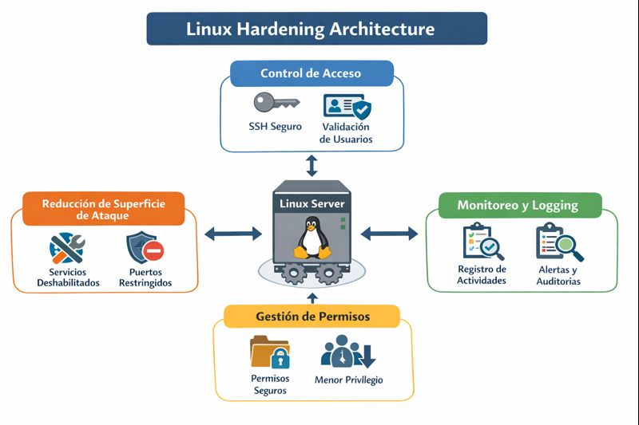

# Linux Hardening

Repositorio enfocado en documentar prácticas de hardening en sistemas Linux, priorizando configuraciones seguras, reducción de superficie de ataque y control de accesos.

Repositorio con documentación y scripts educativos para hardening de sistemas Linux.

## Objetivo

Documentar y explicar configuraciones de seguridad aplicables a sistemas Linux, con cambios claros, justificables y auditables.

## Alcance

- Sistemas Linux de propósito general
- Hardening a nivel sistema
- Configuraciones base de seguridad

## Enfoque

- Cambios progresivos
- Configuraciones mínimas necesarias
- Documentación clara y técnica

## Tabla de contenido
- [Baseline](baseline.md)
- [SSH Hardening](ssh-hardening.md)
- [Servicios y Superficie de Ataque](servicios-superficie.md)
- [Usuarios y Privilegios](usuarios-privilegios.md)
- [Logging y Monitoreo](logging-monitoreo.md)
- [Scripts](scripts/)
- [Diagrama de Arquitectura](diagrams/architecture.png)
- [Services Hardening](services-hardening/README.md)

## Diagrama de Arquitectura

## Estado del proyecto

Documentación inicial en desarrollo.
